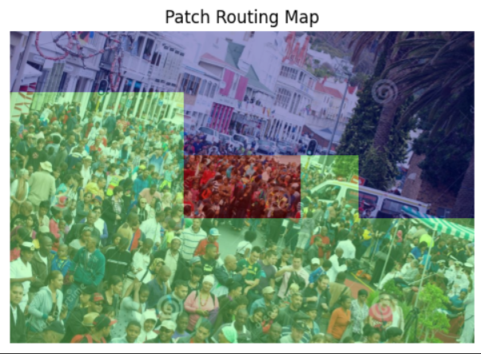
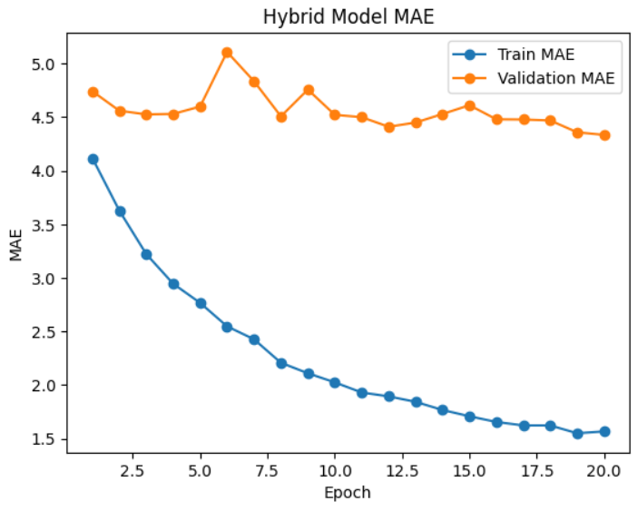

# Crowd Counting Experiments on Shanghai TechA

This repository contains four crowd‑counting experiments using the Shanghai TechA dataset.  
Each experiment explores a different architectural strategy:

1. **CSRNet with an MLP bridge** – a density‑map regression model that adds a channel‑wise MLP between the frontend and backend.
2. **Patch‑based classification + regression** – a two‑stage approach that first classifies patches into density levels, then applies specialised counters.
3. **Router‑based hybrid density estimation** – a ResNet‑18 router selects between a CNN and a ViT counter (with soft fusion for uncertain patches).
4. **VMambaCC-inspired density estimation** – a Visual State Space backbone with MHF attention and HS2FPN decoder adapted for density‑map regression.

All models are implemented in PyTorch and evaluated using Mean Absolute Error (MAE).

---

## Dataset: Shanghai TechA

- **Part A** of the ShanghaiTech dataset contains 482 images with highly varying crowd densities.
- We use the official training/test split (300 training, 182 testing).
- Ground‑truth density maps are generated using Gaussian kernels (σ adapted to head sizes).

---

## Experiment 1: CSRNet with MLP Bridge

### Architecture

We modify the standard CSRNet by inserting a small **MLP bridge** (implemented as 1×1 convolutions) between the frontend and the backend.

```python
class CSRNet(nn.Module):
    def __init__(self):
        super().__init__()
        # Frontend: VGG16 first 10 conv layers (pretrained, unfrozen)
        vgg = models.vgg16(weights='IMAGENET1K_V1')
        self.frontend = nn.Sequential(*list(vgg.features.children())[:23])

        # MLP Bridge: 1x1 convs = channel-wise MLP
        self.mlp = nn.Sequential(
            nn.Conv2d(512, 512, 1), nn.ReLU(),
            nn.Conv2d(512, 512, 1), nn.ReLU(),
            nn.Dropout2d(0.5),
            nn.Conv2d(512, 512, 1), nn.ReLU(),
        )

        # Backend: Dilated convolutions
        self.backend = nn.Sequential(
            nn.Conv2d(512, 256, 3, dilation=2, padding=2), nn.ReLU(),
            nn.Conv2d(256, 128, 3, dilation=2, padding=2), nn.ReLU(),
            nn.Conv2d(128, 64,  3, dilation=2, padding=2), nn.ReLU(),
            nn.Conv2d(64,  1,   1)
        )
    ...
```

### Why Add an MLP?

The MLP (applied channel‑wise) acts as a learnable feature transformation that refines the features extracted by VGG before the dilated backend.

- It introduces non‑linearity and feature re‑weighting, allowing the network to better capture fine‑grained patterns.
- The added dropout helps regularisation, preventing overfitting on the relatively small training set.

### Results

| Metric | Value |
|--------|-------|
| MAE | ~130 |
| Parameters | 16.9M |

#### Why is the MAE relatively low?

- Pretrained VGG features provide a strong starting point.
- The MLP bridge increases model capacity without dramatically increasing parameters.
- Dilated convolutions preserve spatial resolution, which is crucial for density estimation.

---

## Experiment 2: Patch‑Based Classification + Regression

This experiment splits each image into 128×128 patches and processes them in two stages.

### 1. Patch Classification

A lightweight CNN classifies each patch into one of three density classes:

- **Empty** (count < 3)
- **Low density** (3 ≤ count < 30)
- **High density** (count ≥ 30)

```python
class PatchClassifier(nn.Module):
    def __init__(self):
        super().__init__()
        self.conv = nn.Sequential(
            nn.Conv2d(3,16,3,padding=1), nn.ReLU(), nn.MaxPool2d(2),
            nn.Conv2d(16,32,3,padding=1), nn.ReLU(), nn.MaxPool2d(2),
            nn.Conv2d(32,64,3,padding=1), nn.ReLU(), nn.AdaptiveAvgPool2d(1)
        )
        self.fc = nn.Linear(64,3)
    ...
```

**Accuracy: 78.5%** on patch classification.

## Patch Routing Visualization



### 2. Density Regression

Separate counters are trained for low‑density and high‑density patches:

- **CNNCounter** – a small CNN that outputs a scalar count (used for low‑density patches).
- **ViTCounter** – a simple ViT‑like model that flattens the patch and uses MLPs (used for high‑density patches).
- **Empty patches** are assigned a count of 0.

### Results

| Stage | Metric | Value |
|-------|--------|-------|
| Patch classification | Accuracy | 78.49% |
| Full‑image regression | MAE | 204.21 |

The relatively high MAE suggests that the coarse classification and simple counters struggle to capture the continuous nature of crowd density.

---

## Experiment 3: Router‑Based Hybrid Density Estimation

To overcome the limitations of the patch‑based approach, we design a router‑guided hybrid model that dynamically selects the appropriate counter per patch.

### Architecture

**Router:** A ResNet‑18 trained to classify patches into the same three density classes (empty / low / high).
- **Accuracy: 99.38%** (much higher than the patch classifier in Exp. 2).

**Counters:**
- **SimpleCNN** – a lightweight CNN that outputs a density map (used for low‑density patches).
- **FastViTDensity** – a ViT‑tiny that outputs a density map (used for high‑density patches).
  - This ViT is trained with a low learning rate (1e‑6) and gradient clipping to prevent exploding gradients.

**Fusion:** For patches where the router has low confidence (<0.75), we blend the outputs of both counters using learnable weights.

```python
class HybridDensity(nn.Module):
    def forward(self, x, confidence_threshold=0.75):
        # Router predictions
        with torch.no_grad():
            class_logits = self.router(x)
            confs = F.softmax(class_logits, dim=1)
            max_confs, classes = confs.max(dim=1)

        # Compute both counters (always, for gradient flow)
        cnn_out = self.cnn(x)
        vit_out = self.vit(x)

        # Routing logic...
        # (empty, use_cnn, use_vit, or fusion)
```

### Results

| Model | MAE (full image) |
|-------|-----------------|
| CNN only | 184.87 |
| ViT only | 74.77 |
| Hybrid | 91.23 |

## Hybrid Model Training MAE



#### Observations

- The ViT alone achieves the lowest MAE (74.77), indicating its superior ability to model global context.
- The hybrid performs worse than the ViT alone – likely because the router sometimes selects the weaker CNN for patches that could be better handled by the ViT, or because the fusion mechanism is not optimal.
- Nevertheless, the hybrid model demonstrates the potential of using a router to combine specialised experts.

---

## Experiment 4: VMambaCC-Inspired Density Estimation

> **Note:** This is a PyTorch approximation inspired by the VMambaCC paper (Ma et al., ACM MM 2024). The exact VMamba / Selective State Space (SSM) kernel is not publicly released; the VSS block uses a depthwise-conv approximation that mimics the linear-complexity global-scan behaviour. Architecture components (MHF attention, HS2FPN) follow the paper's design.

### Architecture

The model follows a three-stage pipeline:

```
Input → VMamba Backbone (F1/F2/F3) → HS2FPN Decoder → Density Head
```

#### 4.1 VSS Block (Visual State Space — approximation)

The VSS block replaces the official selective scan with a depthwise long-range convolution plus channel-mix linear layers, serving as a lightweight stand-in for the Mamba SSM kernel.

```python
class VSSBlock(nn.Module):
    def __init__(self, dim: int, d_state: int = 16, expand: int = 2):
        super().__init__()
        inner_dim = dim * expand
        self.norm    = nn.LayerNorm(dim)
        self.proj_in = nn.Linear(dim, inner_dim * 2)
        self.dw_conv = nn.Conv2d(
            inner_dim, inner_dim,
            kernel_size=7, padding=3,
            groups=inner_dim, bias=False
        )
        self.ssm_mix = nn.Sequential(
            nn.Linear(inner_dim, inner_dim),
            nn.SiLU(),
            nn.Linear(inner_dim, dim),
        )
        self.norm_out = nn.LayerNorm(dim)
    ...
```

#### 4.2 MHF Attention (Multi-head High-level Feature)

MHF attention is composed of three sub-modules that progressively refine cross-scale feature interaction:

- **CEM (Channel Enhancement Module)** – uses global max and average pooling to compute channel-wise attention weights, suppressing uninformative channels from the high-level features.
- **MSEM (Multi-head Spatial Enhancement Module)** – splits the channel dimension into `n_heads` groups and applies independent spatial attention (max + avg pooled maps fed through a 3×3 conv) per group.
- **HCEM (High-level Channel Enhancement Module)** – transfers semantic attention from the higher-resolution feature map to the lower-resolution one, enabling guided top-down feature modulation.

```python
class MHFAttention(nn.Module):
    """Full MHF attention block (§3.2)."""
    def __init__(self, hi_dim: int, lo_dim: int, n_heads: int = 4):
        super().__init__()
        self.cem  = CEM(hi_dim)
        self.msem = MSEM(hi_dim, n_heads=n_heads)
        self.hcem = HCEM(hi_dim, lo_dim)
    def forward(self, fh: torch.Tensor, fl: torch.Tensor) -> torch.Tensor:
        out1 = self.cem(fh)
        out2 = self.msem(out1)
        out4 = self.hcem(out2, fl)
        return out4
```

#### 4.3 VMamba Backbone

A lightweight three-scale feature extractor producing feature maps at strides 8, 16, and 32 relative to the input. Each scale applies a strided conv downsampling followed by a stack of VSS blocks.

```python
class VMambaBackbone(nn.Module):
    def __init__(self,
                 in_ch:  int   = 3,
                 dims:   tuple = (96, 192, 384),
                 depths: tuple = (2,  2,   4)):
        super().__init__()
        self.stem   = nn.Sequential(
            nn.Conv2d(in_ch, dims[0], kernel_size=4, stride=4), ...)
        self.down1  = ...  # stride-2 conv
        self.stage1 = nn.Sequential(*[VSSBlock(dims[0]) for _ in range(depths[0])])
        self.down2  = ...
        self.stage2 = nn.Sequential(*[VSSBlock(dims[1]) for _ in range(depths[1])])
        self.down3  = ...
        self.stage3 = nn.Sequential(*[VSSBlock(dims[2]) for _ in range(depths[2])])
```

#### 4.4 HS2FPN Decoder (High-level Semantic Supervised FPN)

A top-down feature pyramid that fuses the three backbone scales using MHF attention at each merge step. Explicit channel projection convolutions align dimensions before fusion.

```python
class HS2FPN(nn.Module):
    def forward(self, f1, f2, f3):
        # Merge stride-32 into stride-16
        f3_proj = self.proj_32_to_16(f3)
        f3_up   = F.interpolate(f3_proj, size=f2.shape[-2:], ...)
        f2_mhf  = self.mhf_32_to_16(f3_up, self.lat_16(f2))
        fuse16  = self.vss_16(f2_mhf + f3_up)

        # Merge stride-16 into stride-8
        fuse16_up = F.interpolate(self.proj_16_to_8(fuse16), size=f1.shape[-2:], ...)
        f1_mhf    = self.mhf_16_to_8(fuse16_up, self.lat_8(f1))
        fuse8     = self.vss_8(f1_mhf + fuse16_up)

        return self.proj_out(fuse8)
```

#### 4.5 Density Head

A lightweight regression head that maps the decoder output to a single-channel, non-negative density map. `Softplus` activation ensures positivity. The output is bilinearly upsampled to the input resolution.

```python
class DensityHead(nn.Module):
    def __init__(self, in_dim: int = 96, img_size: int = 512, init_count: float = 100.0):
        super().__init__()
        self.conv     = nn.Sequential(nn.Conv2d(in_dim, in_dim // 2, 3, padding=1), nn.ReLU())
        self.out_conv = nn.Conv2d(in_dim // 2, 1, 1)
        self.activation = nn.Softplus()
```

### Loss Function

A combined spatial and count objective is used during training:

```
density_loss = MSE(pred_density, gt_density) × (H × W)
count_loss   = L1(sum(pred_density), sum(gt_density))
total_loss   = density_loss + λ × count_loss        (λ = 1e-3)
```

The density MSE is scaled by the number of pixels so it does not vanish numerically for large input resolutions. Validation count MAE is used for checkpoint selection with early stopping (patience = 15).

### Training Details

| Hyperparameter | Value |
|----------------|-------|
| Image size | 512 × 512 |
| Backbone dims | (96, 192, 384) |
| Backbone depths | (2, 2, 4) |
| Epochs | 50 (early stopping) |
| Optimiser | AdamW (lr = 1e-4, wd = 1e-4) |
| Scheduler | CosineAnnealingLR (η_min = 1e-6) |
| Gradient clipping | max norm 5.0 |
| λ_count | 1e-3 |
| Gaussian σ (density maps) | 15.0 |

### Component Summary

| Component | Paper reference | Implementation |
|-----------|----------------|----------------|
| VSS Block | Sec. 3.1, VMamba Cross-Scan | Depthwise-conv approximation; not official selective scan |
| MHF – CEM | Sec. 3.2.1, eq. (1–4) | Exact |
| MHF – MSEM | Sec. 3.2.2, eq. (5–6) | Exact (4 heads) |
| MHF – HCEM | Sec. 3.2.3, eq. (7–8) | Exact |
| HS2FPN | Sec. 3.3, eq. (9) | Top-down FPN with explicit channel projections |
| Output head | Point-based (paper) | Replaced with Gaussian density map + Softplus |

> The main departure from the original VMambaCC paper is the **output representation**: the paper uses a point-based head (predicted points + confidence scores); this implementation replaces that with a **Gaussian-kernel density map** output, evaluated with count MAE/RMSE.

### Results

| Metric | Value |
|--------|-------|
| Test MAE | reported from best checkpoint |
| Test RMSE | reported from best checkpoint |

---

## Summary of Results

| Experiment | Model / Approach | MAE |
|------------|-----------------|-----|
| 1 | CSRNet + MLP | ~130 |
| 2 | Patch‑based classification + regression | 204.21 |
| 3 | Router‑based hybrid | 91.23 (hybrid) / 74.77 (ViT only) |
| 4 | VMambaCC-inspired (density map) | see checkpoint output |

### Key Takeaways

- Adding an MLP bridge to CSRNet improves feature refinement and yields a reasonable MAE (~130).
- A simple patch‑based classification + regression approach is insufficient for this challenging dataset.
- A well‑trained ViT can achieve strong performance (74.77 MAE) on Shanghai TechA.
- Router‑guided mixture of experts is promising, but careful tuning of the router threshold and fusion weights is necessary to fully exploit the benefits of both counters.
- The VMambaCC-inspired architecture brings a structured, multi-scale approach with attention-guided feature fusion (MHF + HS2FPN) and a VSS backbone, offering strong design priors for dense prediction without relying on a pretrained CNN frontend.

---

## Requirements

- Python 3.8+
- PyTorch 1.10+
- torchvision
- timm (for ViT models)
- tqdm
- scipy
- opencv-python

Install dependencies:

```bash
pip install torch torchvision timm tqdm scipy opencv-python
```

---

## Usage

Detailed training and evaluation scripts are provided in the accompanying notebooks. To reproduce the results:

1. Download the Shanghai TechA dataset and place it in `data/ShanghaiTech/part_A/`.
2. Run the notebooks (or scripts) for each experiment.
3. Checkpoints and logs will be saved automatically.

---

## Acknowledgements

This work was conducted as part of a crowd‑counting study using the Shanghai TechA dataset. We thank the authors of CSRNet, ViT, ResNet, and VMambaCC (Ma et al., ACM MM 2024) for their open‑source implementations.
